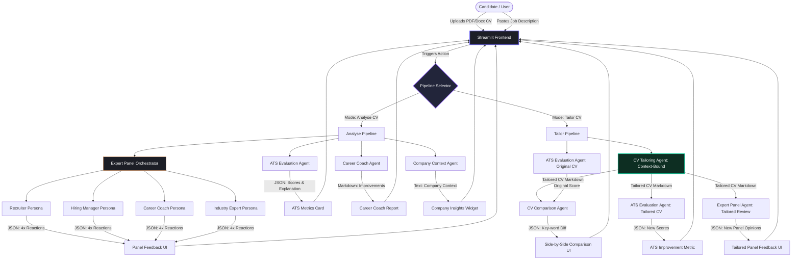

# Project Pitch & Technical Architecture Guide: CV-Agent

This document serves as your complete guide to pitching and explaining the **CV-Agent** project at hackathons, presentations, or investor pitches. It details the technical architecture, the Agentic AI patterns used, and provides a polished 3-4 minute presentation script for a two-person team.

---

## 1. Project Overview & Value Proposition

In the modern job market, candidates face two massive bottlenecks:
1. **The ATS Black Box**: Over 98% of Fortune 500 companies use Applicant Tracking Systems (ATS) to filter resumes based on keywords and formatting before a human recruiter ever sees them. Candidates have zero visibility into why they are rejected.
2. **Generic Resume Fatigue**: Sending the same resume to 100 different roles leads to extremely low response rates. Resumes must be tailored to the specific job post, but doing this manually for every job takes hours.

### The Solution: CV-Agent
**CV-Agent** is an intelligent, multi-agent AI workspace that acts as an automated career coach and resume strategist. By inputting their CV and a target job description, candidates can:
* **Audit their CV** against an enterprise-grade ATS simulator.
* **Get feedback from a simulated panel** of professional personas (Recruiter, Hiring Manager, Career Coach, and Industry Expert).
* **Automatically tailor their resume** for the target role in seconds, adhering to strict zero-hallucination guardrails to ensure truthfulness.
* **Examine a side-by-side comparison** of their original and tailored resumes, showing exactly how and where their ATS score improved.

---

## 2. AI & Agentic AI Technical Breakdown

What makes this project innovative isn't just that it uses a Large Language Model (LLM)—it's how it uses **Agentic AI Architecture** to drive high-fidelity reasoning.

```
┌────────────────────────────────────────────────────────────────────────┐
│                        AGENTIC CORE CONCEPTS                           │
├────────────────────────────────────────────────────────────────────────┤
│ 1. Collaborative Multi-Persona prompting (Consensus-driven feedback)  │
│ 2. Deterministic State Constraints (JSON schemas & output formats)     │
│ 3. Context-Bound Text Generation (Zero-hallucination CV tailoring)     │
│ 4. Sequential Execution Pipeline (ATS scoring -> Tailoring -> Auditing)│
└────────────────────────────────────────────────────────────────────────┘
```

### A. Multi-Agent Persona Orchestration (Expert Panel)
A single LLM prompt requesting feedback often yields generic, mixed advice. CV-Agent resolves this by implementing a **Multi-Agent Collaboration Pattern**:
* **Recruiter Agent**: Evaluates syntactic match, keyword parsing, ATS constraints, and formatting.
* **Hiring Manager Agent**: Focuses on semantic qualities—culture fit, ownership mindset, team leadership, and real impact.
* **Industry Expert Agent**: Evaluates domain-specific technical depth, tool stack relevance, and project complexity.
* **Career Coach Agent**: Generates actionable, structural improvements (suggested skills, wording transformations, missing sections).

By querying these personas in parallel, the system acts like a real-world hiring panel. This consensus-based evaluation guarantees that the candidate gets a holistic, multi-dimensional audit of their application.

### B. Structured Outputs (Guaranteed Schemas)
AI agents must communicate reliably with frontends. We use OpenAI's **Structured Outputs API** (`response_format={"type": "json_object"}`) to enforce strict JSON schemas. This ensures:
1. The AI responses always map to the expected keys (`recruiter`, `hiring_manager`, `career_coach`, `industry_expert`).
2. Numerical metrics (ATS scores, skill matches) are parsed cleanly as integers, allowing the Streamlit UI to render progress bars and gauges without parsing errors.

### C. Zero-Hallucination Constraints (Context-Bound Generation)
A major risk of generative AI in resume writing is "hallucination"—fabricating credentials, jobs, or skills. In professional tailoring, this is fatal.
Our **CV Tailoring Agent** utilizes **Strict Context-Bound Prompts**:
* It is fed the original CV as the *absolute boundary of truth*.
* The system prompt enforces a negative constraint: *“Do not fabricate any experience, skills, education, certifications, projects, or achievements. Use only information present in the original CV.”*
* The agent rewires phrasing, reorders sections by relevance, and matches keywords, but remains 100% factual to the candidate's history.

### D. Sequential Agentic Workflows
The tailoring pipeline is a multi-step sequence where the output of one agent serves as the input to the next:
1. **Input**: User uploads Original CV + Job Description.
2. **Step 1 (ATS Agent)**: Audits original CV → Outputs **Original ATS Score**.
3. **Step 2 (Tailoring Agent)**: Evaluates original CV against Job Description → Outputs **Tailored CV**.
4. **Step 3 (ATS Agent Re-run)**: Audits tailored CV against Job Description → Outputs **New ATS Score**.
5. **Step 4 (Comparison Agent)**: Analyzes Original CV, Tailored CV, and Job Description → Outputs a **Semantic Diff** (keywords added, wording shifts).
6. **Result**: System computes the delta (e.g., +25 points) and renders the comparison UI.

---

## 3. Complete System Workflow Diagram

Below is the complete architectural diagram in Mermaid.js format, showing how data flows between the Streamlit UI, the orchestrator, and the specialized AI agents.



---

## 4. Technical Stack & Implementation

The application is built for speed, responsiveness, and premium developer aesthetics.

* **Backend Orchestration**: Written in Python 3.11, leveraging the **OpenAI SDK** to tap into `gpt-4o`.
* **Frontend**: Built using **Streamlit**. Instead of using the default out-of-the-box widgets, the app injects a **custom CSS UI layer** to implement:
  * A custom dark-mode theme utilizing a curated palette (rich dark grays, electric purple, teal, and soft orange accents).
  * Smooth CSS transitions and hover states for buttons and card widgets.
  * Custom HTML layouts for the ATS Score gauges, expert cards, and comparison metrics.
* **State Management**: Uses Streamlit’s `session_state` to implement cached multi-stage pipelines. By registering callback functions on buttons (`on_click`), we resolve state-mutation race conditions where widget values are updated asynchronously.
* **Document Processing**: Uses `PyPDF2` and `python-docx` for local byte-level text extraction from user-uploaded files, ensuring that complex PDF structures are correctly flattened into clean plain-text strings for the LLM.
* **Containerization**: Includes a production-ready `Dockerfile` and `.dockerignore` targeting python-slim base images, making the app 100% portable and deployable to cloud container platforms like **Railway** or **Render**.

---

## 5. Presentation Pitch Script (3 to 4 Minutes)

This script is designed for **two presenters**:
* **Presenter A (Product & Vision)**: Sets the stage, hooks the audience, details the problem, does the demo, and explains the business impact.
* **Presenter B (Tech & AI Architecture)**: Explains the multi-agent system, the scoring algorithms, the zero-hallucination tailoring pipeline, and system robustness.

---

### [0:00 - 0:45] Minute 1: The Hook & The Problem
**Presenter A:**
> "Hello everyone! Let me ask you a question. How many times have you, or someone you know, applied to dozens of jobs online, only to receive immediate, automated rejections? 
>
> The truth is, your resume isn't even being read by humans. Over 98% of Fortune 500 companies use automated systems called ATS, or Applicant Tracking Systems. They screen resumes using rigid keyword matching, rejecting up to 75% of qualified candidates before a human recruiter ever takes a look. 
> 
> For job seekers, this is a frustrating black box. And trying to manually tailor your resume for every single job description to pass this filter takes hours. 
> 
> Today, we are opening that black box. We built **CV-Agent**—a collaborative, multi-agent AI system that audits, grades, and automatically tailors your CV for any job description in seconds."

---

### [0:45 - 1:45] Minute 2: Technical Architecture & The Agentic Paradigm
**Presenter B:**
> "Let's talk about what makes CV-Agent different from a standard ChatGPT prompt. We aren't just sending a prompt to an LLM and asking it to rewrite a resume. We have built an **Agentic AI Pipeline** powered by `gpt-4o`.
> 
> When you upload your CV, the system spins up a **Collaborative Expert Panel** of four distinct AI agents, each operating with a dedicated system prompt:
> 
> 1. A **Recruiter Agent** checking keyword density and ATS formatting.
> 2. A **Hiring Manager Agent** evaluating culture fit and leadership traits.
> 3. An **Industry Expert Agent** measuring the depth of your technical stack.
> 4. A **Career Coach Agent** outlining actionable, structural improvements.
> 
> Simultaneously, our **ATS Evaluator Agent** parses the inputs and scores the application across four sub-metrics: Skill Match, Experience, Keyword Coverage, and Education. 
> 
> We leverage OpenAI's **Structured Outputs API** to enforce strict JSON schemas. This ensures the numerical evaluations are fully deterministic, allowing us to map them directly to our UI gauges, while keeping the qualitative assessments structurally sound and parse-error free."

---

### [1:45 - 2:45] Minute 3: Demo Walkthrough & Zero-Hallucination Tailoring
**Presenter A:**
> "Let’s take a look at the system in action. *(Direct audience's attention to the slide/demo)*. 
> 
> In **Analyse Mode**, you upload your CV as a PDF or Docx, paste the job description, and click Analyse. Instantly, you get an overall ATS grade out of 100, broken down by category, accompanied by a comprehensive panel review.
> 
> But we didn't stop at analysis. We built **Tailor Mode**. 
> 
> One of the biggest challenges in career AI is hallucination—you don't want an AI inventing a fake degree or an project you never worked on. 
> 
> Our **CV Tailoring Agent** operates under strict, context-bound guidelines. It behaves as a zero-hallucination agent: it is allowed to restructure, emphasize, and rephrase, but it cannot fabricate facts. 
> 
> Once tailored, the system re-runs the ATS auditor on the new CV and generates a side-by-side comparative diff. As you can see on screen, it highlights exactly which keywords were added, what phrasing was upgraded, and displays your score improvement—taking a candidate from a failing 45 score to a highly-competitive 85 in a single click."

---

### [2:45 - 3:30] Minute 4: Deployment, Business Potential & Conclusion
**Presenter B:**
> "From an engineering perspective, the system is lightweight and fully production-ready. 
> 
> It is built on a Python backend with a custom-styled Streamlit frontend, optimized with CSS for a high-end dark-theme interface. It is containerized using Docker, allowing us to deploy it to scalable cloud infrastructure like Railway in minutes, while keeping local development fast and modular. We've also integrated Streamlit's environment secrets management to keep our LLM API keys secure and isolated."

**Presenter A:**
> "By providing real-time feedback and safe, fact-based tailoring, CV-Agent levels the playing field for job seekers. It turns a stressful, blind application process into a data-driven, strategic workflow. 
> 
> CV-Agent is more than a resume builder; it is a collaborative AI career panel in your browser. Thank you, and we’d love to take your questions!"

---

## 6. How to Prepare for Q&A (Common Questions & Answers)

Here are the most common questions judges or technical panels will ask, along with suggested answers:

#### Q1: "How do you ensure the AI doesn't hallucinate experiences or skills?"
> **Answer**: We enforce strict context-boundary instructions in the system prompt. The tailoring agent is instructed that the original CV is the *only source of truth*. We also run a validation step where we cross-reference the output, and because we use structured output schemas, we can expand this to include programmatic validation checks.

#### Q2: "Streamlit isn't typically used for large-scale enterprise frontends. How would you scale this?"
> **Answer**: Streamlit is perfect for prototyping, hackathons, and internal tools because of its rapid iteration speed. To scale this to millions of users, we would decouple the frontend and backend. We would write the orchestrator and agents as a **FastAPI or NestJS backend API** running on Kubernetes, and build a frontend using **React or Next.js** to handle user traffic and file uploads with better web concurrency.

#### Q3: "How accurate is your ATS simulator compared to real ATS software like Workday or Taleo?"
> **Answer**: Most real ATS systems use basic parser libraries (like keyword matchers and regex). Our ATS Evaluator Agent is actually *more advanced* because it uses semantic matching through LLMs rather than raw substring comparisons. It reads between the lines to find synonyms. However, to match corporate ATS systems, our Recruiter Agent specifically evaluates for standard ATS-friendly formats (like simple text flow, no complex multi-column grids) which are known to break traditional parsers.
